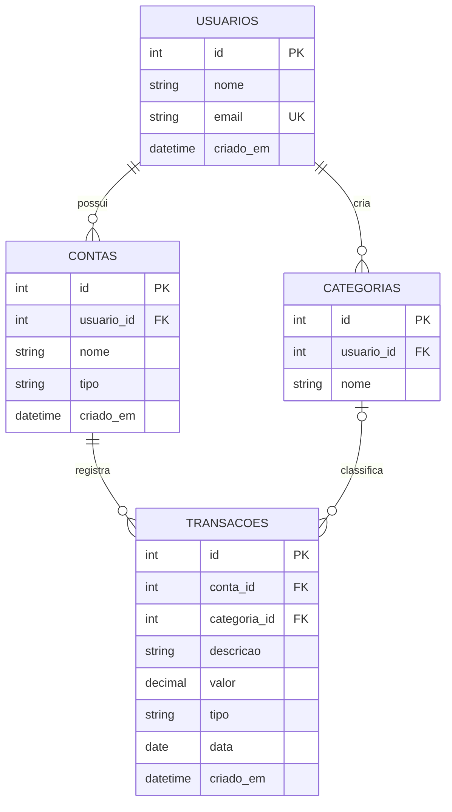

```mermaid
erDiagram
    USUARIOS ||--o{ CONTAS : possui
    USUARIOS ||--o{ CATEGORIAS : cria
    CONTAS ||--o{ TRANSACOES : registra
    CATEGORIAS |o--o{ TRANSACOES : classifica

    USUARIOS {
        int id PK
        string nome
        string email UK
        datetime criado_em
    }
    CONTAS {
        int id PK
        int usuario_id FK
        string nome
        string tipo
        datetime criado_em
    }
    CATEGORIAS {
        int id PK
        int usuario_id FK
        string nome
    }
    TRANSACOES {
        int id PK
        int conta_id FK
        int categoria_id FK
        string descricao
        decimal valor
        string tipo
        date data
        datetime criado_em
    }
```